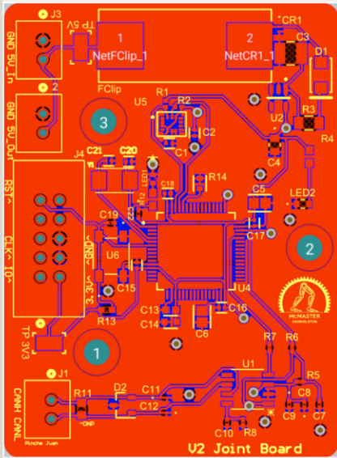
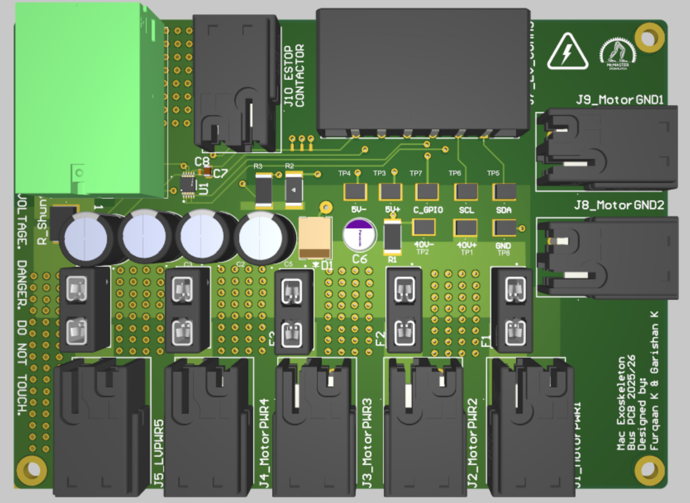

# Furqaan Khurram Qamar

**Mechatronics Engineering @ McMaster University · Toronto, ON**

I work across embedded systems, PCB design, and hardware validation — building things that connect software to the physical world.

**[View Resume](https://github.com/furqaankhurram/furqaankhurram/blob/main/Furqaan_Khurram_Resume.pdf)** · **[Download Resume](https://github.com/furqaankhurram/furqaankhurram/raw/refs/heads/main/Furqaan_Khurram_Resume.pdf)** · [LinkedIn](https://www.linkedin.com/in/furqaan-khurram-qamar/) · [Email](mailto:furqaankhurram@gmail.com)

## Experience

- **Rockwell Automation / Allen-Bradley** — Embedded Systems Engineer, Co-op · Jan–Dec 2026
- **McMaster Exoskeleton** — Sensing & Actuation Lead · Oct 2024–Present · [Repo](https://github.com/macexo/exoskeleton-sensing-actuation)
- **Mac Formula Electric** — LV Electronics / Firmware · Oct 2025–Present · [Dashboard repo](https://github.com/macformula/racecar/tree/main/projects/dashboard)
- **McMaster Engineering Faculty** — Engineering Computing TA · Sep 2025–Present

<b>Engineering work & highlights</b>

### Rockwell Automation

- **Thermocouple DAQ:** Designed and programmed a board for systems up to 600 V, with <2°C accuracy and 20 kHz current sampling for RMS measurement.
- **PF6000 power-cell control board:** Designed the third revision in Siemens Xpedition, integrating a co-processor and functional-safety hardware while reducing board size.
- **PF6000 simulation interface:** Designed and validated hardware in KiCad, including debugging and board bring-up.
- **Test automation:** Built a Python/CIP tool for remote FPGA and fiber-optic parameter management, reducing setup from 5 hours to ~10 minutes across four global R&D teams.

### McMaster Exoskeleton

[Sensing & actuation repository](https://github.com/macexo/exoskeleton-sensing-actuation)

- Led an **11-member team** developing an **800 Hz** control pipeline across eight IMUs and four motors, using Kalman and complementary filtering.
- Designed a **four-layer, 48 V / 50 A** power-distribution board in Altium, with high-current routing, thermal design, and controlled emergency discharge.
- Led electrical debugging and failure isolation during competition integration.

**Joint sensing PCB**

**Power-distribution PCB**

### Mac Formula Electric

[Dashboard source](https://github.com/macformula/racecar/tree/main/projects/dashboard)

- Migrated an STM32 dashboard to **LVGL 9.3**, reducing flash usage by **176 KB / 10.4%**.
- Built a modular StatusBar for persistent fault reporting and real-time **CAN telemetry** for inverter states, temperatures, pack voltage, and discharge current.

### Teaching

- Supported **30+ students** with file I/O, conditionals, loops, and object-oriented programming.

## Projects

| Project | What I built | Links |
| :--- | :--- | :--- |
| **JamDeck** · MakeUofT 2026 Audio Winner | ESP32 music controller with five sensor/input systems, C++ firmware, input filtering, and JSON events over WiFi. | [Repo](https://github.com/damhahlat/JamDeck) · [Demo](https://www.youtube.com/watch?v=r-VzDs2Of34) · [Devpost](https://devpost.com/software/jamdeck) |
| **ServeSim** · Hack the North 2025 | A scaled volleyball-training robot with adjustable spin and aim. I focused on circuit design, testing, and validation, with contributions to the rig and firmware. | [Demo & Devpost](https://devpost.com/software/servesim-volleyball-training-robot) |
| **Automated Wrestling Scoring** | ESP32/Bluetooth scoring interface with under 100 ms response; Python/OpenCV move detection with ~75% preliminary accuracy. | [Demo](https://drive.google.com/file/d/1tKSFpLKwo4Y2rgY6CST-jRGl1yGSClOa/view) |

Also: [RFID escape-room demo](https://github.com/furqaankhurram/furqaankhurram/raw/refs/heads/main/assets/rfid-demo.mp4).

## Skills

| Area | Skills & tools |
| :--- | :--- |
| **Lab & validation** | Oscilloscopes · Soldering · Board bring-up & debugging · Hardware validation · Failure isolation |
| **Hardware** | PCB & schematic design · ARM Cortex-M · STM32 · ESP32 · Arduino UNO · Sensors & IMUs · High-current routing · Thermal design |
| **Embedded & controls** | FreeRTOS · Mbed OS · LVGL · MCU architecture · Kalman & complementary filtering · Real-time control |
| **Protocols** | UART · SPI · I2C · CAN · EtherNet/IP · CIP · JTAG · Bluetooth · WiFi |
| **Applications & design** | Altium Designer · Siemens Xpedition / Mentor Graphics · KiCad · LTspice · Simulink · Git |
| **Programming** | C / C++ · Python · OpenCV · JSON · Object-oriented programming · Data structures & algorithms |

## Education & Recognition

**B.Eng. Mechatronics Engineering (Co-op), McMaster University**  
Expected April 2028 · **3.93/4.00 GPA** · Dean’s Honour List, all academic terms

MakeUofT Audio Winner · Hack the North Semifinalist

Relevant coursework

Electronics & Instrumentation · Embedded Systems · Data Structures & Algorithms · Signals & Systems

## Outside of Work

Wrestling, powerlifting, canoeing, and backcountry camping.

<!-- Add personal photos here later, e.g.  -->
